
操作系统环境：

<pre>CentOS 5.5 x84_64位
Zabbix版本2.2.3
Web服务器：LNMP
</pre>

环境部署，参考其他靠谱文档，建议官方文档，今天我们聊聊zabbix邮件告警的事。
项目即监控项，触发器相当于给监控项设置阈值，根据表达式触发触发器，产生报警。
关于操作系统CentOS6.0 以下版本都是通过mail命令调用sendmail的sm-client发送邮件，所以如果关闭sendmail按照很多网上的文档是发不出邮件的。

那么mail命令如果仔细观察的话其实调用的是mailx来调用第三方非本地smpt服务。

<h2>一.   首先卸载（或停止） senmail升级安装mailx</h2>
<h4>1)       停止sendmail:</h4>
<pre><code>
[root@localhost ~]# /etc/init.d/sendmail stop
[root@localhost ~]# chkconfig sendmail off
[root@localhost ~]#
</code></pre>

<h4>2)安装mailx：</h4>
<pre><code>
[root@localhost workplace]# ls
mailx-12.4  mailx-12.4.tar.bz2  zabbix-2.2.3  zabbix-2.2.3.tar.gz mailx-12.4-openssl_1.0.0_build_fix-1.patch
[root@localhost workplace]# tar -jxf mailx-12.4.tar.bz2 
#注意 打patch
[root@localhost workplace]#
[root@localhost workplace]# cd mailx-12.4
[root@localhost workplace]# patch  -Np1 -i mailx-12.4-openssl_1.0.0_build_fix-1.patch
[root@localhost mailx-12.4]# make &&  make install UCBINSTALL=/usr/bin/install
</code></pre>

如果碰到错误自行解决.

<h4>3)       配置mailx：</h4>
<pre><code>
[root@localhost ~]# cd /usr/local/bin/
[root@localhost bin]# cp mailx /bin/mail
cp: overwrite `/bin/mail'? y
[root@localhost bin]#
</code></pre>
<h4>4)       配置第三方smtp服务：</h4>

可以注册新浪邮箱测试发送给网易邮箱

<pre><code>
[root@localhost ~]# vi /etc/nail.rc
set from=test001@sina.com              #你的用户名
set smtp=smtp://smtp.sina.cn:25
set smtp-auth-user= test001@sina.com   #你的用户名
set smtp-auth-password= test001        #你的密码
</code></pre>
<h4>5)       测试发送一份邮件</h4>
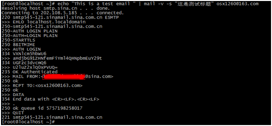

登陆163查看是否收到邮件。

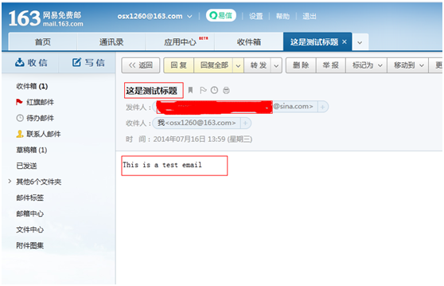

调用第三方邮件服务器配置完成，mailx的好处是占用系统资源小，速度快，配置简洁。
也可以使用它连接公司内部服务器，这样做就更好了。

<h2>二.   Zabbix 配置文件配置。</h2>
<h4>1）  首先我们配置zabbix的配置文件，使其示警媒介支持脚本。</h4>
修改<code>zabbix_server.conf</code>中的
<pre><code># AlertScriptsPath=${datadir}/zabbix/alertscripts</code></pre>

为

<pre><code>AlertScriptsPath=/usr/loca/zabbix/alertscripts</code></pre>

<h4>2）  建立示警媒介可执行脚本的存放目录：</h4>
<pre><code>
[root@localhost ~]# mkdir /usr/local/zabbix/alertscripts
[root@localhost ~]# chmod 755 /usr/local/zabbix/alertscripts
[root@localhost ~]# chown -R zabbix:zabbix /usr/local/zabbix/alertscripts
</code></pre>
<h3>这几步相当重要！！！</h3>
<h4>3）  脚本的编写：</h4>
<pre><code>
[root@localhost ~]# cat /usr/local/zabbix/alertscripts/sendmail.sh
#!/bin/bash
echo "$3" | /bin/mail   -s "$2"  $1
[root@localhost ~]#

非常简单：
	说明一下：
	$3是邮件内容
	$2 邮件标题
	$1 发送给谁
</code></pre>

<h2>三.   Zabbix  web页面配置：</h2>
<h4>1）  示警媒介配置：</h4>
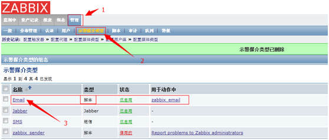
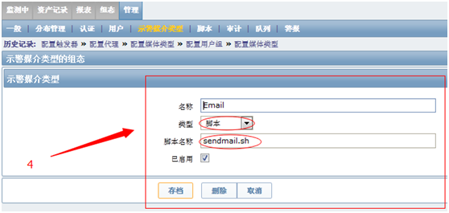

注意其中的类型以及脚本名称

类型选择脚本，名称选择你在alertscripts目录下建立的脚本文件名称。

<h4>2）  用户配置</h4>
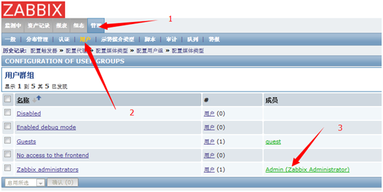
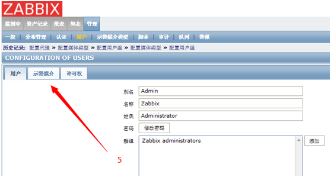
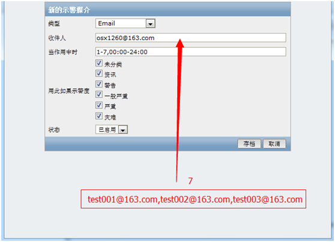

多个收件人，注意以逗号隔开，然后存档。

注意这个类型选择你在示警媒介中定义的名称。

<h4>3）  动作配置：</h4>
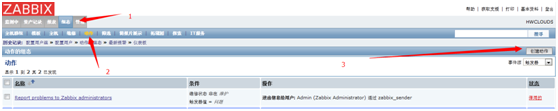
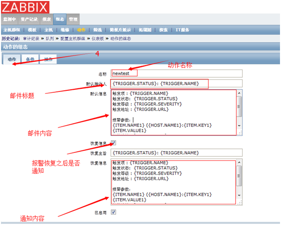
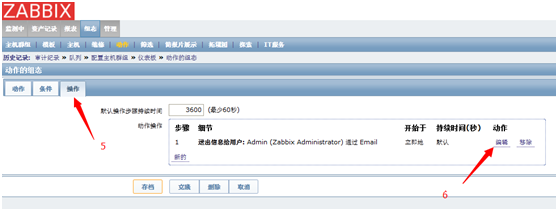
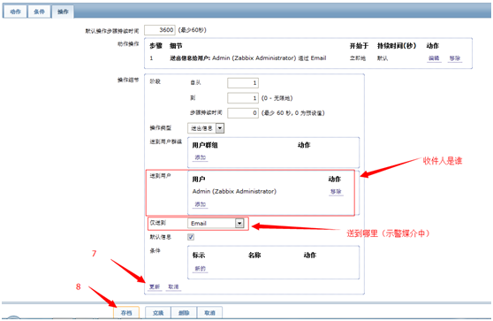

<h4>4）  测试一下：</h4>

把触发项的阈值调节一下

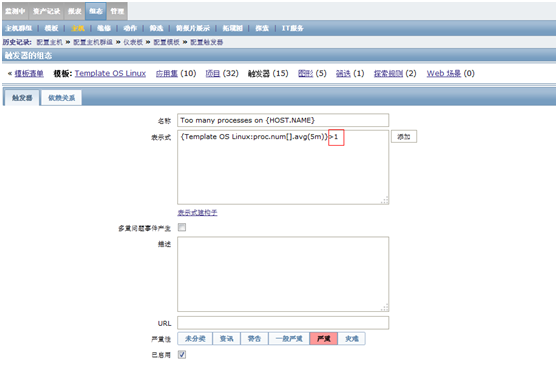

邮件效果：

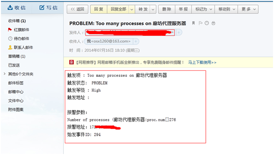

<h4>5）  邮件发送成功在web上页面上如何看到？</h4>
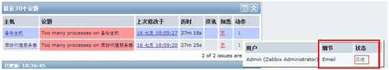
<h4>6）  如果邮件发送在linux服务商能成功，就是zabbix发送不成功，在那里看？</h4>

在51cto有朋友可能遇到这个问题，怎么排错

<h5>1.首先检查权限，给zabbix脚本目录可执行权限，以及用户，并使用zabbix用户看能否发出邮件，如果是755的权限，基本是不用zabbix用户就能发出来邮件。</h5>
<h5>2.接着就是同zabbix web自带的审计</h5>
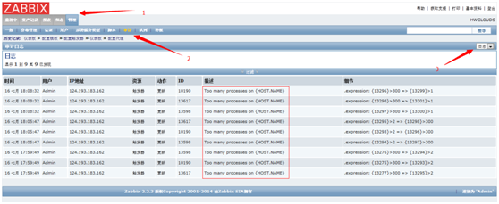
<h5>如果信息发送不成功，通常会显示在信息栏，比如超时，等等。在信息栏看到：Timeout while executing a shell script 说明zabbixserver 的timeout设置的过低所以发不出去邮件，默认是3秒，改成10-30秒的样子应问题解决！</h5>
